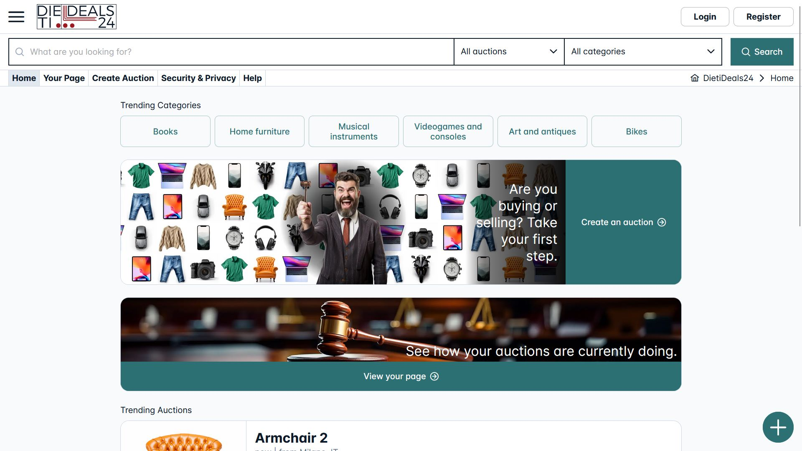
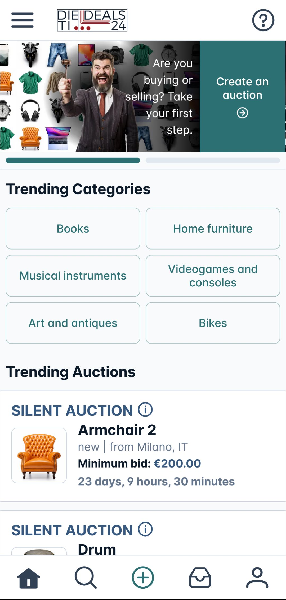
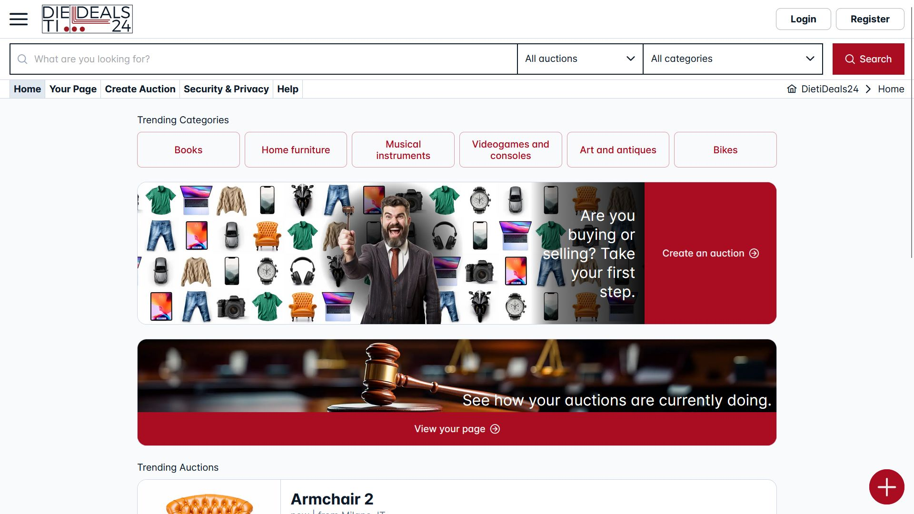
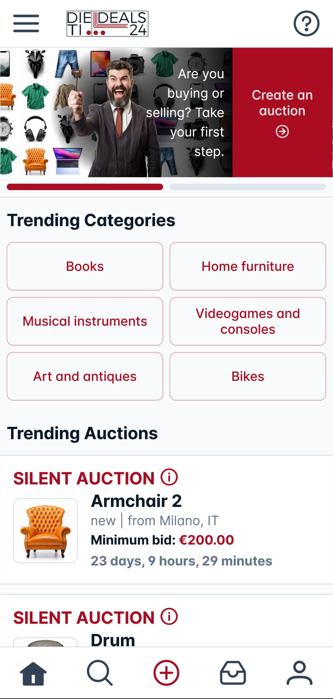
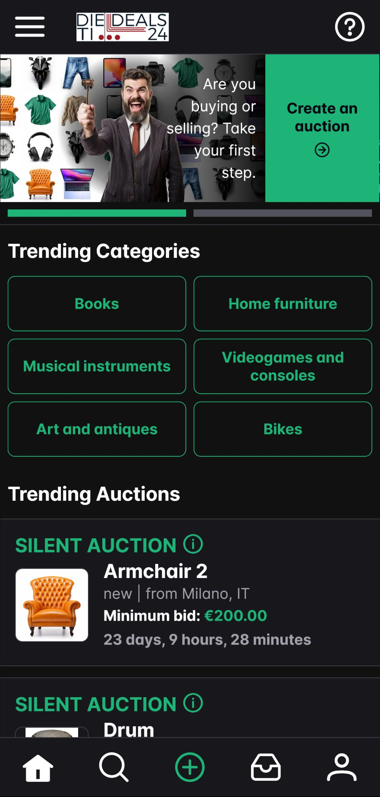
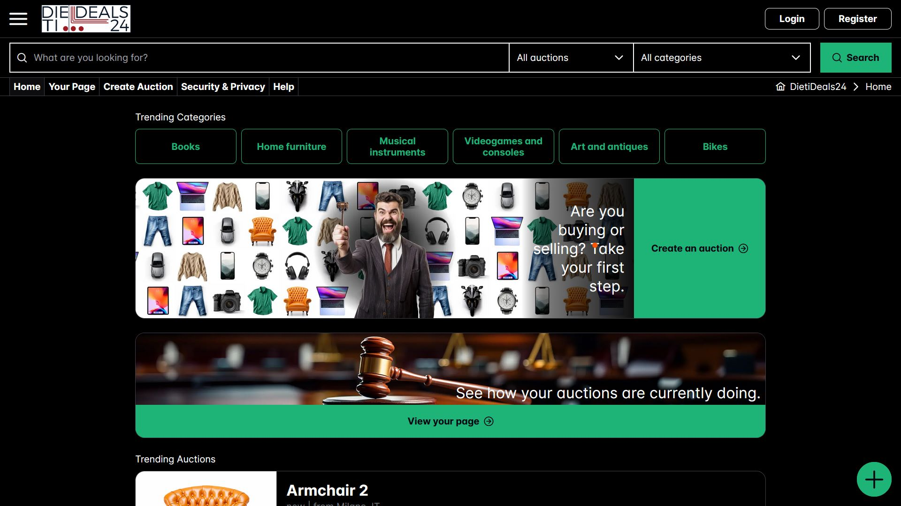
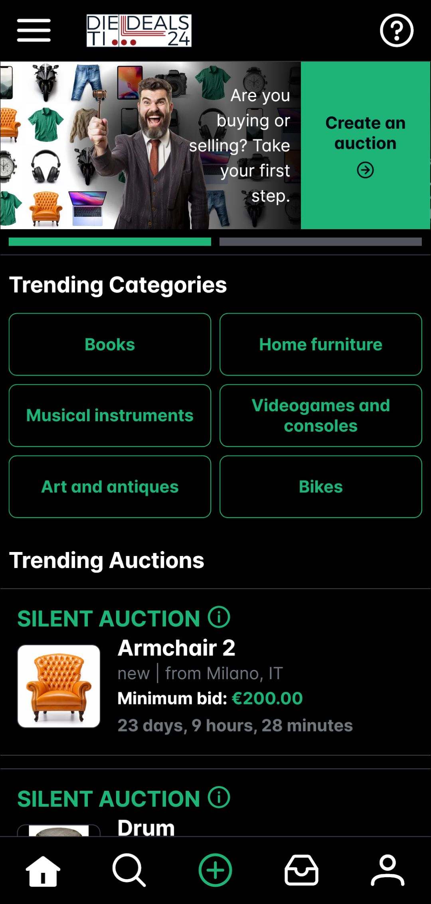

# DietiDeals24

This repository was used for the development of the frontend client of the DietiDeals24 platform, developed in 2024 as part of a student project for the Software Engineering course in the Computer Science degree at the University of Naples Federico II. This project was developed by the student group with ID INGSW2324_12.

## Angular 17

DietiDeals24 is a web application developed using the Angular v17 framework for its frontend, and the Java Spring framework, along with other various technologies, for its backend. The frontend, whose source code is stored in this repo, follows Angular conventions for file naming and project structure, separating classes based on their role (components, services, resolvers, guards, pipes, etc.). However, a strong preference for class-based entities was maintained, in contrast to Angular's recent shift towards function-based solutions for features like resolvers, interceptors, and guards, as required by the project specifications.

## PrimeNG

The PrimeNG UI library was initially adopted for its input components, but later also used for components such as sidebars, dialogs, toast messages, and so on. When necessary, the components were customized to match the platform's Mockups.

## Responsive

The DietiDeals24 web app is designed to work on a vast range of devices, with significant changes in the general UI for mobile viewports. The goal was to meet the requirements and conventions of both the desktop and mobile platforms.

## Progressive Web App

DietiDeals24 can be installed on mobile devices through the install option of browsers. Significant efforts were made to make the application feel as close to native as possible, and we have reached a point where we can confidently say that, if the PWA were to be uploaded to a mobile app store such as Google Play, most non-technical Android users would likely not notice that the app is not native.

## User experience personalization

The DietiDeals24 app offers both light and dark themes, with multiple variations for each mode. Notably, there is a version of the dark theme specifically designed for OLED screens. As AMOLED screens are increasingly common on Android devices, this feature enhances the experience for many mobile users.

## Screenshots

<table cellspacing="0" cellpadding="0" style="border-collapse: collapse; border: none;">
  <tr>
    <td style="width: 74%; vertical-align: bottom; padding: 0; border: none;">
      
    </td>
    <td style="width: 6%; padding: 0; border: none;"></td>
    <td style="width: 20%; vertical-align: bottom; padding: 0; border: none;">
      
    </td>
  </tr>
    <tr>
    <td style="width: 74%; vertical-align: bottom; padding: 0; border: none;">
      
    </td>
    <td style="width: 6%; padding: 0; border: none;"></td>
    <td style="width: 20%; vertical-align: bottom; padding: 0; border: none;">
      
    </td>
  </tr>
    <tr>
    <td style="width: 74%; vertical-align: bottom; padding: 0; border: none;">
      
    </td>
    <td style="width: 6%; padding: 0; border: none;"></td>
    <td style="width: 20%; vertical-align: bottom; padding: 0; border: none;">
      
    </td>
  </tr>
  <tr>
    <td style="width: 74%; vertical-align: bottom; padding: 0; border: none;">
      
    </td>
    <td style="width: 6%; padding: 0; border: none;"></td>
    <td style="width: 20%; vertical-align: bottom; padding: 0; border: none;">
      
    </td>
  </tr>
</table>
